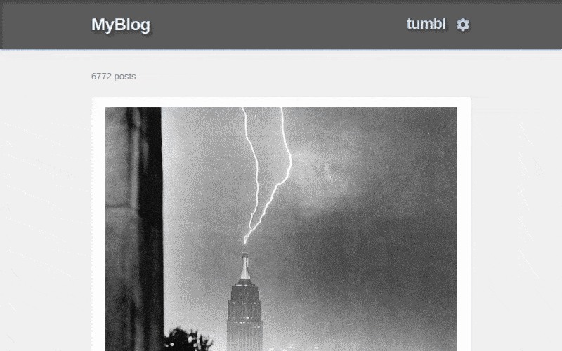
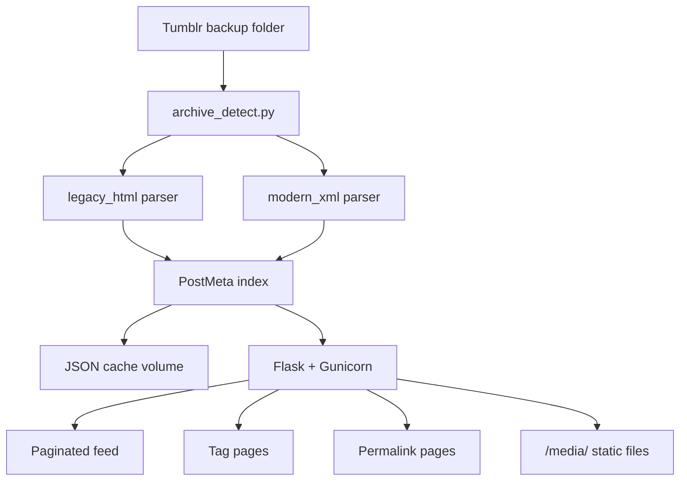

# tumbl

> Relive your Tumblr blog from a backup export — locally, privately, and in classic Tumblr style.

[](https://www.python.org/downloads/)
[](https://flask.palletsprojects.com/)
[](https://www.docker.com/)
[](LICENSE)

**tumbl** is a self-hosted viewer for Tumblr blog backup exports. 

Point it at an archive folder, open your browser, and browse your old posts in a faithful recreation of Tumblr's classic blog theme — no Tumblr account required, no data leaving your machine.

<p align="center">
  
</p>

---

## Features

- **Paginated post feed** with newest-first ordering
- **Full-text search** across post bodies and tags (`/search?q=…`)
- **Tag cloud** with post counts (`/tags`)
- **Post type filters** for photos, audio, video, and text (`/type/photo`, etc.)
- **Date archive** browsing by year and month (`/archive`)
- **Photo lightbox** with keyboard navigation on image posts
- **Tag filtering** and permalink pages for individual posts
- **Classic Tumblr UI** — centered column, navy header, white post cards, tag pills
- **Multi-format support** for legacy, modern, and tumblr-utils exports
- **Auto-extract `posts.zip`** on startup for modern exports
- **Background indexing** with live progress on first load
- **Docker-first** deployment with a persistent index cache for fast restarts
- **Fully offline** — your archive never leaves your computer

---

## Supported export formats

| Format | Source | Layout signature | Status |
|--------|--------|------------------|--------|
| Legacy HTML backup | Tumblr (early automated export) | `posts/html/*.html` + `media/` | Supported |
| Official Tumblr ZIP export | Tumblr (current, via Settings → Export) | `posts/posts.xml` + `media/` | Supported |
| `tumblr-utils` / `tumblr-backup` | Third-party ([bbolli/tumblr-utils](https://github.com/bbolli/tumblr-utils)) | `index.html` + `posts/*.html` | Supported |
| Tumblr privacy data JSON | Account settings download | JSON account dump | Out of scope |

### Format details

#### Legacy HTML backup (Format A)

Tumblr's early export, typically unzipped to a `.tumblrbackup`-style folder:

```
archive/
├── media/                  # {postId}.jpg, {postId}_0.gif, etc.
├── conversations/          # HTML conversations (optional)
└── posts/
    ├── style.css
    ├── posts_index.html
    └── html/
        ├── {postId}.html
        └── submissions/
            └── {postId}.html
```

Metadata lives entirely in the HTML — timestamps and tags are parsed from each file's footer.

#### Modern official export (Format B)

What Tumblr provides today via [**Settings → Export**](https://help.tumblr.com/export-your-blog/). After downloading the ZIP, **fully extract it** — including `posts.zip`:

```
export-folder/
├── media/
├── messages.xml            # conversations (not yet displayed)
└── posts/                  # extract posts.zip here
    ├── posts.xml           # canonical structured post data
    └── html/
        └── {postId}.html
```

tumbl reads `posts.xml` as the source of truth and resolves images from the local `media/` folder, falling back to Tumblr CDN URLs when local files are missing.

> **Note:** tumbl auto-extracts `posts.zip` on startup when needed. You can also extract it manually before launch.

#### tumblr-utils backup (Format C)

Community backups created with [tumblr-backup](https://github.com/bbolli/tumblr-utils) use a flat layout:

```
export-folder/
├── index.html
├── media/
└── posts/
    └── {postId}.html
```

tumbl reads each post from `posts/{id}.html` and resolves local media from the `media/` folder.

---

## Quick start

### Prerequisites

- [Docker](https://www.docker.com/get-started/) and Docker Compose

### 1. Export your Tumblr blog

Follow [Tumblr's official export guide](https://help.tumblr.com/export-your-blog/). Download the ZIP, extract it fully (including `posts.zip` → `posts/`), and note the folder path.

### 2. Mount your archive and run

Place your extracted archive at `.tumblrbackup/` in this repo (or change the volume path in `docker-compose.yml`):

```bash
docker compose up --build
```

### 3. Open your blog

Visit **http://localhost:8862**

On first launch, tumbl indexes your posts in the background (typically 20–30 seconds for a few thousand posts). You'll see a loading page until the index is ready. Subsequent starts load from cache in under a second.

---

## Configuration

Set these environment variables in `docker-compose.yml` or pass them at runtime:

| Variable | Default | Description |
|----------|---------|-------------|
| `ARCHIVE_PATH` | `/archive` | Path to the extracted Tumblr backup inside the container |
| `CACHE_DIR` | `/app/cache` | Writable directory for the JSON index cache |
| `BLOG_TITLE` | `MyBlog` | Default blog title (used until overridden in Settings) |
| `INDEX_WORKERS` | `4` | Parallel workers used when building the index |

Example with a custom archive path:

```yaml
services:
  tumbl:
    volumes:
      - /path/to/my/export:/archive:ro
    environment:
      - BLOG_TITLE=My Cool Blog
```

---

## How it works



1. On startup, tumbl detects which export format is present
2. The appropriate parser builds a normalized index of all posts
3. The index is cached to disk for fast subsequent launches
4. Flask serves a paginated feed, tag-filtered views, and individual post pages
5. Local media files are served from the archive's `media/` directory

---

## Development

### Local setup (without Docker)

```bash
pip install -r requirements.txt
set ARCHIVE_PATH=.tumblrbackup   # Windows
export ARCHIVE_PATH=.tumblrbackup  # macOS/Linux
python -m flask --app app.main run --debug
```

### Rebuilding the index

tumbl automatically rebuilds the index when the archive changes (for example, after adding or removing posts). To force a rebuild manually, delete the cache files and restart:

```bash
docker compose exec tumbl rm -f /app/cache/index-legacy_html.json /app/cache/index-legacy_html.meta.json
docker compose restart tumbl
```

Cache filenames are format-specific: `index-legacy_html.json`, `index-modern_xml.json`.

### Project structure

```
tumbl/
├── app/
│   ├── main.py              # Flask routes
│   ├── parser.py            # Index facade
│   ├── archive_detect.py    # Format detection
│   ├── parsers/
│   │   ├── base.py          # PostMeta model
│   │   ├── legacy_html.py   # Format A parser
│   │   └── modern_xml.py    # Format B parser
│   ├── static/tumblr.css
│   └── templates/
├── docker-compose.yml
├── Dockerfile
├── requirements.txt
└── LICENSE
```

---

## Roadmap

- [ ] Messaging / conversations viewer (`messages.xml`)
- [ ] Open Graph images on permalink pages
- [ ] Random post (`/random`)
- [x] Full-text search
- [x] Tag cloud / tag index page
- [x] Date archive (month/year browsing)
- [x] `tumblr-utils` export format support
- [x] Auto-extract `posts.zip` on startup
- [x] Photo lightbox
- [x] Post type filters
- [x] Async index build with live progress
- [x] Theme customization (dark mode, background color/image, blog title via Settings)

---

## Contributing

Contributions are welcome. Open an issue to discuss larger changes before submitting a pull request.

---

## License

[MIT](LICENSE) — see [LICENSE](LICENSE) for details.

---

## Acknowledgements

- Export format research informed by [TEV (Tumblr Export Viewer)](https://github.com/tiyb/tev) and [tumblr-utils](https://github.com/bbolli/tumblr-utils)
- Not affiliated with Tumblr or Automattic