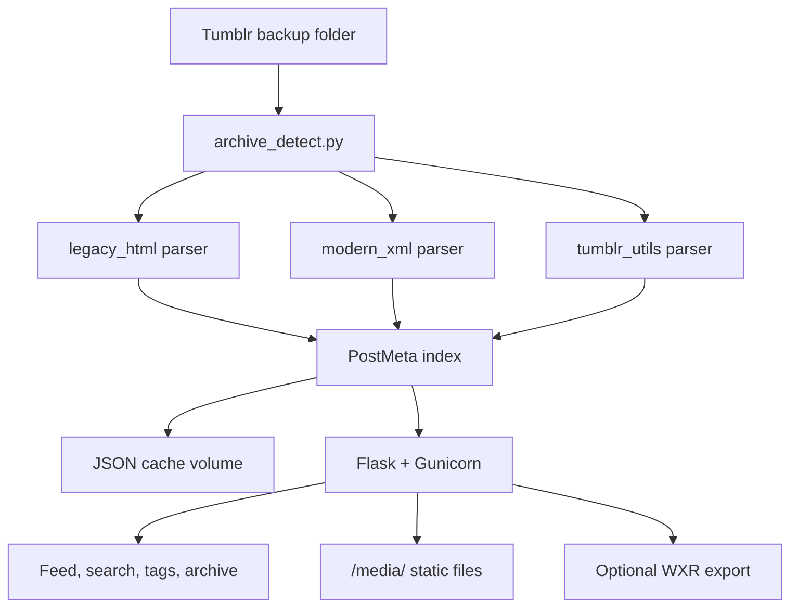

# tumbl

Self-hosted viewer for Tumblr blog backup exports. 

Point it at an archive folder and browse your posts locally in a classic Tumblr-style theme. 

No account required, no data sent anywhere.

[](https://www.python.org/downloads/)
[](https://flask.palletsprojects.com/)
[](https://www.docker.com/)
[](LICENSE)

<p align="center">
  
</p>

## Features

- Paginated feed, full-text search, tag cloud, and date archive
- Post type filters (photo, audio, video, text), photo lightbox, and **Random** post (`/random`)
- Permalink pages with Open Graph previews (`og:image`, `og:site_name`) for sharing
- Keyboard shortcuts: **`/`** search, **`j`/`k`** navigate posts, **`?`** show hints
- **View on Tumblr** links and reblog context when export metadata includes them
- Legacy, modern, and tumblr-utils export formats
- Optional WordPress WXR export for migrating offline backups to WordPress
- Auto-extract `posts.zip`, background indexing with progress, persistent cache
- Docker-first, fully offline

## Supported export formats

| Format | Source | Layout signature | Status |
|--------|--------|------------------|--------|
| Legacy HTML backup | Tumblr (early export) | `posts/html/*.html` + `media/` | Supported |
| Official Tumblr ZIP | [Settings → Export](https://help.tumblr.com/export-your-blog/) | `posts/posts.xml` + `media/` | Supported |
| tumblr-utils | [bbolli/tumblr-utils](https://github.com/bbolli/tumblr-utils) | `index.html` + `posts/*.html` | Supported |
| Privacy data JSON | Account settings download | JSON account dump | Out of scope |

Directory layouts, extraction notes, and format-specific behavior are documented in **[Export formats](docs/export-formats.md)**.

## Quick start

**Prerequisites:** [Docker](https://www.docker.com/get-started/) and Docker Compose

1. **Export your blog** — Follow [Tumblr's export guide](https://help.tumblr.com/export-your-blog/), download the ZIP, and extract it (including `posts.zip` → `posts/` if present).
2. **Mount the archive** — Place the extracted folder at `.tumblrbackup/` in this repo, or update the volume path in `docker-compose.yml`.
3. **Run** — `docker compose up --build`
4. **Open** — [http://localhost:8862](http://localhost:8862)

First launch indexes posts in the background (often 20–30 seconds for a few thousand posts; large archives may take a few minutes). Later starts load from cache in under a second. See **[Performance](docs/performance.md)** for tuning large exports (~5 GB+).

## Configuration

| Variable | Default | Description |
|----------|---------|-------------|
| `ARCHIVE_PATH` | `/archive` | Path to the backup inside the container |
| `CACHE_DIR` | `/app/cache` | Writable directory for the JSON index cache |
| `BLOG_TITLE` | `MyBlog` | Default blog title (overridable in Settings) |
| `INDEX_WORKERS` | `4` | Parallel workers when building the index |
| `BACKGROUND_IMAGE` | _(empty)_ | Optional default background: HTTPS URL or file path under the archive/app root |

### Optional: WordPress export

Disabled by default. See **[WordPress export](docs/wordpress-export.md)** for import steps and media notes.

| Variable | Default | Description |
|----------|---------|-------------|
| `WORDPRESS_EXPORT_ENABLED` | `false` | Enable WXR export at `/export/wordpress.xml` |
| `WORDPRESS_EXPORT_AUTHOR` | `admin` | Author login for imported posts |
| `WORDPRESS_EXPORT_SITE_URL` | `https://example.wordpress.com` | Target WordPress site URL |
| `WORDPRESS_EXPORT_MEDIA_BASE_URL` | _(empty)_ | Optional public base URL for archive media |

See [docker-compose.yml](docker-compose.yml) example.

## How it works



On startup, tumbl detects the export format, builds a normalized post index (cached to disk), and serves paginated views plus local media from the archive.

## Development

**Local run (no Docker):**

```bash
pip install -r requirements.txt
set ARCHIVE_PATH=.tumblrbackup   # Windows
export ARCHIVE_PATH=.tumblrbackup  # macOS/Linux
python -m flask --app app.main run --debug
```

```
tumbl/
├── app/                  # Flask app, parsers, static assets, templates
├── docs/                 # export-formats.md, wordpress-export.md, security.md, performance.md
├── tests/
├── docker-compose.yml
├── Dockerfile
└── requirements.txt
```

**Force index rebuild** — delete cache files and restart:

```bash
docker compose exec tumbl rm -f /app/cache/index-*.json /app/cache/index-*.meta.json
docker compose restart tumbl
```

Cache filenames are format-specific (`index-legacy_html.json`, `index-modern_xml.json`, etc.).

**Tests:**

```bash
docker compose exec tumbl python -m unittest discover -s tests -v
```

## Security

HTML sanitization, zip guards, path validation, and security headers are documented in **[Security](docs/security.md)**.

## Roadmap

- [ ] Messaging / conversations viewer (`messages.xml`)
- [x] Open Graph images on permalink pages
- [x] Random post (`/random`)
- [x] Keyboard shortcuts, Tumblr/reblog links, lazy-loaded images
- [x] Full-text search, tag cloud, date archive
- [x] tumblr-utils support, auto-extract `posts.zip`, photo lightbox
- [x] Post type filters, async indexing, theme customization
- [x] Optional WordPress WXR export for offline Tumblr backups

## Contributing

Issues and pull requests are welcome. For larger changes, open an issue first to discuss approach.

## License

[MIT](LICENSE)

## Acknowledgements

Export format research informed by [TEV](https://github.com/tiyb/tev) and [tumblr-utils](https://github.com/bbolli/tumblr-utils).

**Disclaimer:** tumbl is an independent project and is not affiliated with, endorsed by, or sponsored by Tumblr, Yahoo!, or Automattic. Tumblr and related marks are trademarks of their respective owners.
