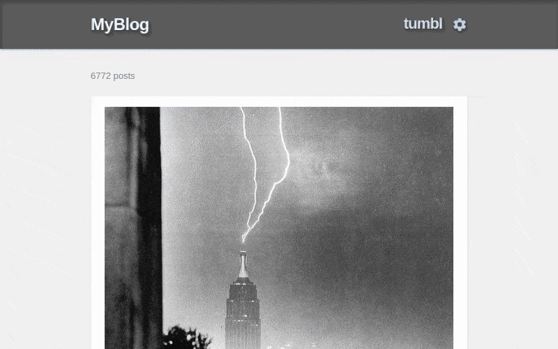

<h1 align="center">tumbl</h1>

  Self-hosted viewer for Tumblr blog backup exports. 
  Browse your posts locally in a classic Tumblr-style theme. No account required, no data sent anywhere.

  
  
  
  

  

## Features

- Paginated feed, full-text search, tags, date archive, and post type filters
- Permalink pages with photo lightbox, editable tags, Open Graph previews, and **View on Tumblr** links
- **Random** post, plus keyboard shortcuts: **`/`** search, **`j`/`k`** navigate, **`?`** help
- Works with legacy, modern, and tumblr-utils exports ([formats](docs/export-formats.md))
- Optional [WordPress export](docs/wordpress-export.md) to migrate posts to a WordPress site
- Auto-extracts `posts.zip`, indexes in the background, and caches the result; Docker-first and fully offline

## Quick start

Requires [Docker](https://www.docker.com/get-started/) and Docker Compose.

1. [Export your blog](https://help.tumblr.com/export-your-blog/) from Tumblr and extract the ZIP.
2. Put the extracted folder at `.tumblrbackup/` in this repo (or [change the mount](docs/configuration.md#mounting-your-archive)).
3. Run `docker compose up --build`.
4. Open [http://localhost:8862](http://localhost:8862).

The first launch indexes your posts in the background. Later starts load from cache in under a second.

## Documentation

| Guide | Covers |
|-------|--------|
| [Configuration](docs/configuration.md) | Environment variables and archive mounting |
| [Export formats](docs/export-formats.md) | Supported Tumblr backup layouts and quirks |
| [Performance](docs/performance.md) | Large archives, caching, and tuning |
| [WordPress export](docs/wordpress-export.md) ([quick start](docs/wordpress-export-quickstart.md)) | Migrating your archive into WordPress |
| [Security](docs/security.md) | Sanitization, limits, and residual risk |
| [Development](docs/development.md) | Local setup, tests, scripts, and contributing |

## License

[MIT](LICENSE). Export format research informed by [TEV](https://github.com/tiyb/tev) and [tumblr-utils](https://github.com/bbolli/tumblr-utils).

tumbl is an independent project and is not affiliated with, endorsed by, or sponsored by Tumblr, Yahoo!, or Automattic. Tumblr and related marks are trademarks of their respective owners.
